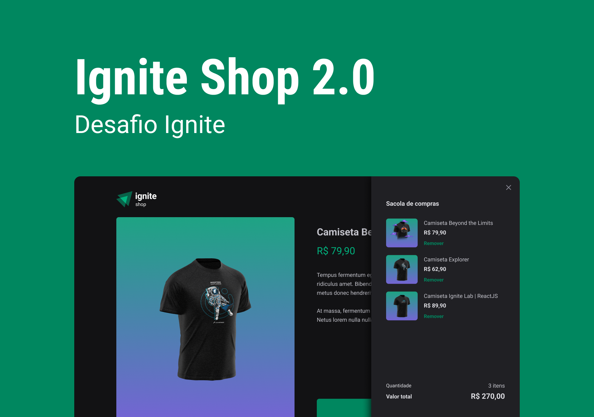

# Ignite Shop 2.0

> Loja virtual desenvolvida com Next.js, estilização com Stitches e gerencimento pelo Stripe.

## 📲 [Link do deploy](https://ignite-shop-five.vercel.app/)



## 📑 Sobre o projeto

Esta aplicação é projeto do módulo de "Fundamentos de Next.js" do curso de especialização Ignite.

-  **Ignite Shop** é parte desenvolvida durante a prática guiada e implementa as funcionalidades iniciais contidas neste [layout](<https://www.figma.com/file/MjcXVLgQxiPU8s2LuKwstR/Ignite-Shop-(Copy)>).

-  **Ignite Shop 2.0** é o desafio do módulo e adiciona as funcionalidades deste [layout](<https://www.figma.com/file/DdDCcDXklWykjkW3AkL6UZ/Ignite-Shop-2.0-(Copy)?node-id=0%3A1>).

## ✍🏻 Funcionalidades

Esta aplicação simula uma loja de blusas cujo gerenciamento de estoque de produtos e finalização de pedidos é feito pela biblioteca **Stripe**.

### Ignite Shop

-  Implementa carrossel para exibir os produtos
-  Implementa página de detalhes do produto com botão para finalizar a compra (só é possível comprar um produto por vez)
-  Implementa página de sucesso caso o usuário tenha concluído a compra

### Ignite Shop 2.0

-  Adiciona as funcionalidades:
   -  Dialog do Carrinho no Header
   -  Sidebar para exibir os produtos, valor da compra e botão de finalizar a compra (é possível comprar mais de um produto por vez)
   -  Os produtos podem ser adicionados ou removidos do carrinho através da página página principal e de detalhes

## 🧑🏻‍💻 Para testar

-  Finalize o pedido normalmente, e use os seguintes dados para pagamento:

```
Número do cartão: 4242 4242 4242 4242
Validade: qualquer data futura no formato > 12/34
CVV: qualquer combinação de 3 digitos > 123
```

## 🧠 Aprendizados

-  Conceitos de Server-Side Renderig (SSR) e Static Site Generation (SSG)
-  Conceitos fundamentais do Next.js
-  Implementar layouts por página
-  Uso da biblioteca de estilização Stitches

## 🛠 Tecnologias utilizadas

-  Typescript
-  Next.js
-  Stripe
-  Stitches
-  React-toastify
-  Axios
-  Keen-slider
